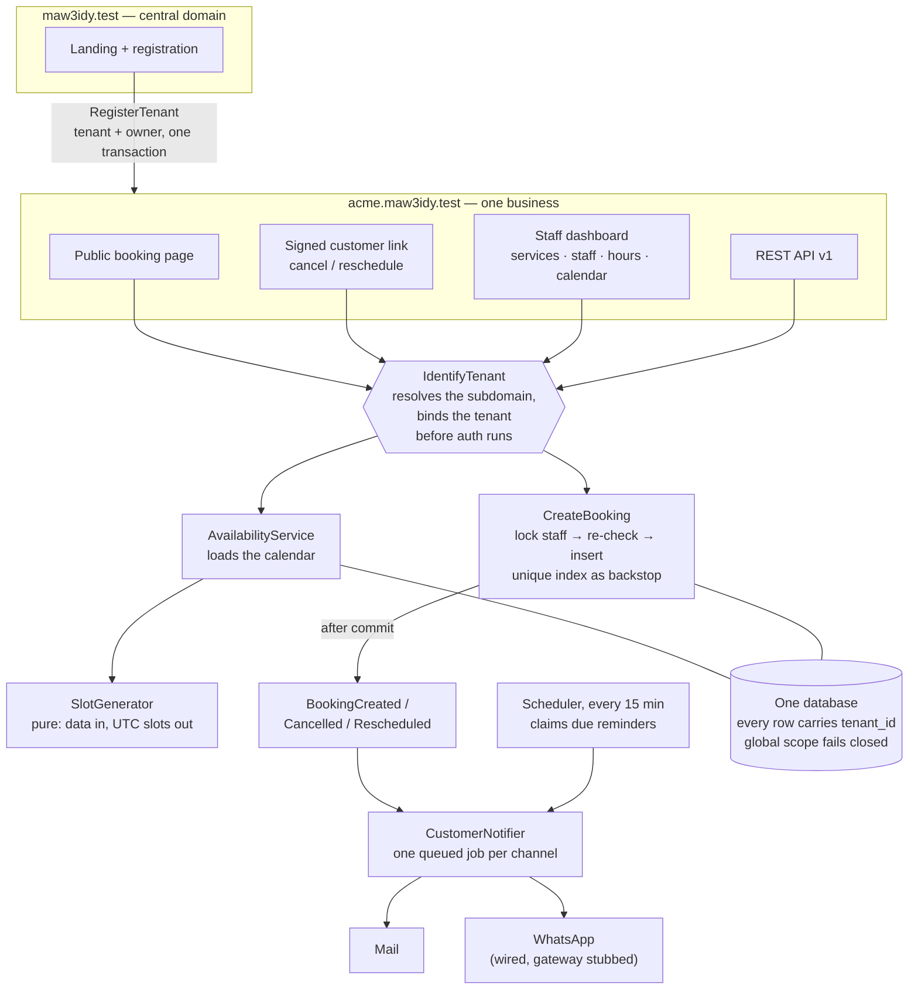

<h1 align="center">Maw3idy — مَوعِدي</h1>

<p align="center">
  Multi-tenant appointment booking for small service businesses — salons, clinics, tutors.<br>
  Each business gets its own subdomain, staff schedules, and a public booking page; the platform
  guarantees isolation, correct availability across timezones, and no double bookings.
</p>

<p align="center">
  <a href="https://github.com/basmakamal/maw3idy/actions/workflows/ci.yml"></a>
  
  
  
  <a href="LICENSE"></a>
</p>

> **Status:** feature-complete for v1. Multi-tenancy with tenant-scoped auth, the booking
> domain with a pure availability engine and a race-proof booking flow, notifications,
> customer self-service, a dashboard calendar, Arabic and English with RTL, and a documented
> REST API. Progress is tracked in [`ROADMAP.md`](ROADMAP.md); each phase landed as a pull
> request with its own self-review.

---

## How it fits together



## Running locally

Prerequisites: PHP 8.2+, Composer 2, Node 22, MySQL 8 / MariaDB 10.4+.

```bash
mysql -uroot -e "CREATE DATABASE maw3idy; CREATE DATABASE maw3idy_test;"
composer setup   # install, .env, app key, migrate, build assets
composer dev     # server + queue worker + logs + Vite, in one terminal
```

Then open <http://maw3idy.localhost:8000> and register a business. Tenants live on
subdomains, e.g. <http://demo.maw3idy.localhost:8000>; `*.localhost` resolves to the loopback
address in every modern browser, so no hosts-file entries are needed.

`composer fresh` seeds two demo tenants, each with services, staff, weekly hours and a few
upcoming bookings. Sign in with the password `password`, or book as a customer on `/book`:

| Tenant | Dashboard | Public booking page | Owner |
|--------|-----------|---------------------|-------|
| Demo Salon (English) | `demo.maw3idy.localhost:8000` | `demo.maw3idy.localhost:8000/book` | `owner@demo.test` |
| صالون الجمال (Arabic, RTL) | `jamal.maw3idy.localhost:8000` | `jamal.maw3idy.localhost:8000/book` | `owner@jamal.test` |

The test suite has three parts: `Unit` (the availability engine runs without a database),
`Feature` (HTTP and Livewire, each test in a rolled-back transaction) and `Concurrency`
(separate PHP processes fired at the same slot against committed data). `composer test` runs
all three.

Mail is written to `storage/logs` by default; point `MAIL_MAILER=smtp` at Mailpit on
`127.0.0.1:1025` to read it in a browser. Reminders need the scheduler and a queue worker:

```bash
php artisan schedule:work
php artisan queue:work
```

Quality gates — the same ones CI runs:

```bash
composer check          # pint --test, larastan (level 6), pest
composer test           # just the test suite
composer test:coverage  # coverage + the floors in scripts/coverage-gate.php (needs pcov or xdebug)
composer lint           # auto-fix code style
composer docs           # regenerate the API reference into public/docs
composer demo           # reset the database and reseed the two demo tenants
```

## API

A documented REST API lives on each business's own subdomain. The reference, an OpenAPI 3.1
spec and a Postman collection are generated into [`public/docs`](public/docs) and served at
`/docs`; CI regenerates them and fails if the committed copy is stale.

Reading the catalogue and availability needs no token, which is what a booking widget wants:

```bash
curl "http://demo.maw3idy.localhost:8000/api/v1/services"
curl "http://demo.maw3idy.localhost:8000/api/v1/services/1/availability?date=2026-10-05"
```

Writing needs a token whose abilities cover the action:

```bash
TOKEN=$(curl -s -X POST "http://demo.maw3idy.localhost:8000/api/v1/tokens" \
  -H "Accept: application/json" \
  -d "email=owner@demo.test&password=password&device_name=cli&abilities[]=bookings:write" \
  | php -r 'echo json_decode(stream_get_contents(STDIN), true)["token"];')

curl -X POST "http://demo.maw3idy.localhost:8000/api/v1/bookings" \
  -H "Authorization: Bearer $TOKEN" -H "Accept: application/json" \
  -d "service_id=1&starts_at=2026-10-05T07:00:00Z&customer_name=Basma&customer_phone=0501234567"
```

## Stack

| Layer | Choice |
|-------|--------|
| Framework | Laravel 12, PHP 8.2+ |
| UI | Blade + Livewire, Tailwind CSS 4 (RTL-aware) |
| Data | MySQL 8, single database with `tenant_id` scoping |
| Queue / cache | Database driver locally; Redis-ready via config |
| API | REST, Sanctum tokens with abilities, OpenAPI 3.1 generated by Scribe |
| Testing | Pest 3 (unit, feature, concurrency, architecture presets), Larastan level 6, Pint |
| CI | GitHub Actions: style → static analysis → dependency audit → tests on PHP 8.2 & 8.3 against MySQL 8 → coverage floors → API reference freshness |

## Architecture decisions

Short, dated records of the choices that shape the codebase. Newer decisions are appended
as the project grows; the tenancy and availability-engine decisions arrive with their phases.

**ADR-001 · Laravel 12 on PHP 8.2 (2026-09-10).** Laravel 13 requires PHP 8.3; the
development machine ships PHP 8.2 and the project deliberately avoids Docker. Laravel 12 is
still under security support, the upgrade path to 13 is mechanical, and CI already tests
against PHP 8.3 so the jump costs nothing later.

**ADR-002 · No Docker; CI is the reproducible environment (2026-09-10).** Local runs use
the native PHP/MySQL stack. Reproducibility comes from a pinned `composer.lock` /
`package-lock.json` and a CI pipeline that builds from a clean Ubuntu image with a real
MySQL service on every push. Trade-off: contributors need PHP and MySQL installed; gain: no
virtualisation overhead and a simpler mental model for a solo project.

**ADR-003 · Tests run on MySQL, not SQLite (2026-09-10).** The two riskiest behaviours in
this domain — tenant isolation and the double-booking guard (unique index + row lock in a
transaction) — depend on real database semantics. SQLite would make the suite faster and lie
about correctness. The test database is reset per test with `RefreshDatabase`.

**ADR-004 · Immutable dates everywhere (2026-09-10).** `Date::use(CarbonImmutable::class)`
is set globally. The availability engine does heavy date arithmetic; mutable Carbon lets
`$slot->addMinutes()` silently corrupt the value the caller still holds. Immutability turns
that bug class into a non-issue.

**ADR-005 · Fail loudly outside production (2026-09-10).** `Model::shouldBeStrict()` is on
in local/testing: lazy loading, missing attributes and silently discarded fills throw, so
the test suite catches them. In production the same code degrades gracefully. Destructive
database commands are prohibited in production.

**ADR-006 · One database, a `tenant_id` on every row (2026-09-16).** Database-per-tenant
buys physical isolation and per-tenant restore at the price of N migrations, N backups, N
connection pools and a tenant-aware migrator on every deploy. For a product whose tenants
are salons with hundreds of rows each, that is the wrong trade: a single schema with
`tenant_id` costs one migration run, one backup, and lets the platform do cross-tenant
reporting with a plain query. Isolation becomes an application invariant instead of a
physical one, so it is enforced in three layers: a global scope on every tenant-owned model
(`BelongsToTenant`), write guards that throw on any cross-tenant create or move
(`TenantMismatchException`), and an architecture test that fails the build if a model in
`App\Models` forgets the trait. Composite unique indexes (`tenant_id, email`) keep
uniqueness per tenant. Choose the opposite when a regulator demands data residency per
customer, when one tenant is large enough to need its own scaling and restore story, or
when tenants need schema customisation.

**ADR-007 · Fail closed when no tenant is bound (2026-09-16).** Querying a tenant-owned
model with no tenant in context throws `TenantNotBoundException`. Returning every tenant's
rows would be a data leak; returning none would hide bugs as empty screens. Cross-tenant
work is therefore explicit and greppable: `TenantContext::runAs($tenant, fn)` for acting on
behalf of one tenant (registration, jobs, the reminder scheduler), `Model::withoutTenancy()`
for a deliberate global query. Console commands and jobs must declare their tenant, which
is a feature.

**ADR-008 · Subdomain per tenant, host-only sessions (2026-09-16).** The tenant is read
from the host (`acme.maw3idy.test`) by a `TenantResolver` strategy, so the API can later
bind a header- or token-based resolver without touching the middleware. Session cookies
stay host-only (no leading-dot `SESSION_DOMAIN`): a session created on one tenant is never
even presented to another. Should a shared cookie ever arrive, the user provider looks the
session's user up inside the tenant scope and finds nothing. Registration happens on the
central domain and hands off to the tenant's own login page rather than auto-signing in
across subdomains, which would need a signed single-use token; that polish is deferred.
Locally `*.localhost` gives zero-config subdomains; production needs a wildcard DNS record
and a wildcard certificate.

**ADR-009 · Tenant identification runs before authentication (2026-09-16).**
`IdentifyTenant` is prepended to the middleware priority list ahead of `Authenticate`,
`ThrottleRequests` and `SubstituteBindings`, so the session user, rate-limit keys and
route-model bindings all resolve inside the tenant scope. Livewire's update endpoint is
re-registered on the tenant domain with the same middleware; otherwise component
re-hydration would run tenantless and fail closed. The tenant is forgotten in the
middleware's `terminate()` so nothing outlives its request.

**ADR-010 · The availability engine is pure (2026-09-16).** `SlotGenerator` takes data and
returns data: a request (day, timezone, duration, buffer, grid interval) and a staff
member's calendar (weekly hours, absences, existing bookings) in, UTC periods out. No
queries, no clock of its own, no tenant lookup. Every hard case (split shifts, closing-time
fit, back-to-back with and without buffers, overnight spill-over, "now", DST days) is a unit
test that runs in milliseconds without a database, and `AvailabilityService` is the single
seam where Eloquent enters. The cost is a handful of small value objects (`Period`,
`WorkingHours`, `SlotRequest`, `StaffCalendar`); the gain is that the centrepiece of the
product is its most tested and least coupled code.

**ADR-011 · Double-booking guard: lock, re-check, insert, with a unique index as backstop
(2026-09-16).** Two customers can pick the same slot at the same second. `CreateBooking`
runs one transaction: `SELECT … FOR UPDATE` on the staff member's row serialises every
attempt for that person; availability is then re-checked reading existing bookings with
`FOR UPDATE` as well, because under MySQL's default REPEATABLE READ a plain `SELECT` may
return the snapshot taken before the lock was granted; only then is the row inserted. A
unique index on `(staff_id, starts_at, slot_lock)` remains as the last line of defence
(`slot_lock` is `NULL` for cancelled bookings, so cancelled slots reopen), and its violation
is translated into the same `SlotUnavailableException`. The index alone would not do: it
cannot see two bookings with different starts that overlap. "Anyone available" resolves the
candidates first and locks them in id order so concurrent requests cannot deadlock. The
`Concurrency` test suite proves it with separate PHP processes released at the same
millisecond: exactly one wins.

**ADR-012 · Time model: UTC instants inside, tenant-local calendar at the edges
(2026-09-16).** Weekly hours are local clock times per weekday (a salon opens at 09:00
whether or not the clocks changed), bookings and time off are UTC instants, and a "day" for
availability is a calendar date in the tenant's timezone. Eloquent's datetime cast formats a
Carbon instance in *its own* timezone, which silently stores local times as UTC; a
`UtcDateTime` cast converts on every write so that mistake cannot be made. Buffer semantics
are deliberate and tested: the service must fit within working hours, its buffer may spill
past closing or into time off, but neither the service nor its buffer may touch another
booking or that booking's buffer.

**ADR-013 · Bookings snapshot the service (2026-09-16).** Duration, buffer and price are
copied onto the booking. Renaming, repricing or shortening a service afterwards changes
future offers but never rewrites what a customer already agreed to, and the availability
engine keeps blocking the time that was actually promised.

**ADR-014 · Our own message layer, not Illuminate notifications (2026-09-17).** A customer
is a name and a phone number on a booking row, never a `Notifiable` model, so `App\Messaging`
defines its own `CustomerChannel` contract: each channel says whether it is configured and
whether it can reach *this* customer, and `CustomerNotifier` queues **one job per channel**
so a refused SMTP handshake retries without re-sending what already went out. Every job
restores the booking's tenant (a worker has no request, so nothing is bound) and switches to
the tenant's language before any text is built; mail additionally pins that locale onto the
Mailable, because a Mailable renders lazily and would otherwise pick up whatever locale is
active at render time. WhatsApp ships as a fully wired, tested channel whose gateway
implementation logs instead of calling the Business API: turning it on is a config flag plus
one class. The cost of not using Laravel's notification system is losing its database and
broadcast channels for free; the gain is that the customer model stays a row, not a user.

**ADR-015 · Reminders come from a scheduled query, not delayed jobs (2026-09-17).** A job
delayed by 24 hours is a promise held by the queue: flush it, redeploy onto a fresh Redis, or
lose the server, and the reminder is gone silently. Instead a command runs every fifteen
minutes and asks which confirmed bookings start within the reminder window and have no
`reminder_sent_at`. A conditional `UPDATE` claims each one before it is queued, so two
overlapping runs cannot double-send, and an hour of downtime delays reminders rather than
losing them. A booking cancelled in between is skipped twice over: by the query, and by the
job re-checking relevance before it renders.

**ADR-016 · Customer self-service is a signed URL plus a capability token (2026-09-17).**
The link in the confirmation email is a signed route carrying the booking's random
`cancel_token`. The signature rejects crafted, truncated or probed links before any database
lookup; the token is the authority, so there is no customer login to build and no password to
reset; and the lookup still runs inside the tenant scope, so another tenant's token is a 404
rather than someone else's phone number. The link does not expire, because a customer needs
it right up to the appointment. Instead, changes are refused inside a configurable notice
period (default two hours), which staff can always override from the dashboard. In the
Livewire component the token is `#[Locked]` and every action re-reads the booking by it, so
nothing is trusted between requests.

**ADR-017 · Language is a per-visitor choice over a per-tenant default (2026-09-17).** Each
tenant has a locale, and that is what a visitor sees first. A switcher can override it, and
the choice lives in the session, which is host-only: a customer who prefers English at one
salon does not change what another salon's customers see. Arabic is a full translation
(`lang/ar.json` plus validation and auth messages), and a test walks every `__()` call in the
codebase and fails if any string is missing from it, so the translation cannot quietly rot.
Layouts use logical CSS properties throughout (`ms-`, `me-`, `text-start`), so right-to-left
is one `dir` attribute rather than a parallel stylesheet.

**ADR-018 · The API lives on the tenant's subdomain (2026-09-18).** `acme.maw3idy.test/api/v1`
rather than a central `api.maw3idy.test`. The subdomain already identifies the business, so
no request carries a tenant id that could be tampered with, and the API reuses the same
`IdentifyTenant` middleware, the same scope and the same actions as the web app. Sanctum's
token lookup is central, but the user behind a token is loaded through the tenant scope, so a
token minted at one business resolves to nobody at another and returns `401` — isolation
comes from the existing mechanism rather than a new check. A token-based resolver stays
possible later: `TenantResolver` is an interface precisely for that.

**ADR-019 · Public reads, authenticated writes (2026-09-18).** The catalogue and availability
are public, because they are the same facts the tenant's own booking page already shows
anyone, and a booking widget needs them without shipping a secret to the browser. They are
throttled per tenant and caller. Everything that writes needs a token, and each token carries
explicit abilities (`services:read`, `bookings:read`, `bookings:write`) with reads as the
default, so an integration that only displays a diary cannot take a slot. A booking's
`cancel_token` never appears in API responses: it is the customer's capability, not the
integration's.

**ADR-020 · Generated docs are committed and CI proves they are current (2026-09-18).**
Scribe reads the routes, form requests and attributes and writes HTML, an OpenAPI 3.1 spec
and a Postman collection into `public/docs`. Committing generated files earns its keep here:
the reference is browsable in the repository and publishable to GitHub Pages unchanged, and
CI regenerates it and fails on any diff, so a merged change to a route or a response shape
must arrive with its documentation. That check only works if generation is deterministic,
which took three fixes: no date stamp, a pinned Postman collection id, and pinned examples
for parameters whose `in` rules would otherwise be sampled at random. Generation binds a
tenant for the run, because the form requests ask the bound tenant for its timezone and id
and a console command has none.

**ADR-021 · A Content-Security-Policy with per-request nonces, and one honest exception
(2026-09-18).** Each response generates a nonce and hands it to Vite and Livewire, so the
browser executes only the scripts that response vouched for; `frame-ancestors 'none'` and
`object-src 'none'` close the obvious gaps. `script-src` still allows `unsafe-eval`, because
Alpine — which ships inside Livewire — compiles its expressions with the `Function`
constructor. Removing it means adopting Alpine's CSP build and rewriting every inline
expression, which is a real change rather than a config tweak, so the policy states the
exception instead of hiding it. A report-only switch exists for tightening the policy safely.
This was verified in a browser, not only in tests: a booking was completed end to end on the
demo tenant with no console violations, because a CSP that breaks the app is a CSP nobody
keeps.

**ADR-022 · Coverage floors per area, not one average (2026-09-18).** CI enforces 80% across
the suite, and separately 95% on the availability engine and 90% on the tenancy layer. A
single overall number can sit comfortably above its floor while the two pieces that would
hurt most if they broke quietly go untested; `scripts/coverage-gate.php` reads the Clover
report and fails on whichever floor is missed.

## Deploying

The application needs three things beyond a normal Laravel deploy:

1. **Wildcard DNS** — an `A` record for `maw3idy.example` and another for `*.maw3idy.example`,
   so every tenant subdomain reaches the same application.
2. **A wildcard certificate** — `certbot certonly --dns-<provider> -d maw3idy.example -d
   '*.maw3idy.example'`. Wildcards require the DNS-01 challenge; HTTP-01 cannot issue them.
3. **A worker and the scheduler** — `php artisan queue:work` for notifications and
   `php artisan schedule:run` every minute for reminders. Without them bookings still work,
   but nobody is told about them.

Set `APP_CENTRAL_DOMAIN` to the bare domain, `APP_URL` to `https://` + that domain, point
`QUEUE_CONNECTION` and `CACHE_STORE` at Redis, and configure a real `MAIL_MAILER`.

## Security baseline

See [`SECURITY.md`](SECURITY.md). In short: a Content-Security-Policy with per-request
nonces, global security-headers middleware, strict Eloquent, a centralised password policy
with breach checking in production, tenant isolation enforced by a fail-closed query scope
and asserted by tests, capability tokens rather than customer accounts, rate limits on every
credential and public endpoint, dependency audits on every CI run, and Dependabot.
Architecture tests (Pest presets `php`, `security`, `laravel`) fail the build on `dd()`,
`md5()`, `eval()` and friends.

## Roadmap

The full plan, with checkboxes, lives in [`ROADMAP.md`](ROADMAP.md).

**Deliberately not built.** Each of these is a real feature, not an oversight, and each was
left out to keep v1 honest about what it does well:

- **Payments and subscriptions.** Taking money means a PSP integration, refunds, invoices,
  dunning and tax. The booking flow does not need it to be useful, and half of it would be
  worse than none.
- **SMS.** The channel abstraction is built and WhatsApp is wired against a gateway contract,
  so adding a provider is one class. Without an account there is nothing honest to demo, and
  a stub that pretends to send is a lie in the code.
- **A mobile app.** The public booking page is responsive and the API exists for anyone who
  wants to build one.
- **Database-per-tenant.** Argued against in ADR-006, along with the conditions that would
  change the answer.
- **Group bookings, resources and recurring appointments.** All three change the availability
  engine's core assumption that one booking occupies one staff member for one interval. That
  is a v2 design, not a patch.

Smaller items deferred with their phases (lead time before a slot, gap-filling slots, ICS
attachments, a daily digest for staff, moving a booking to a different staff member) are
listed at the end of each phase in [`ROADMAP.md`](ROADMAP.md).

## License

[MIT](LICENSE) © 2026 Basma Kamal
